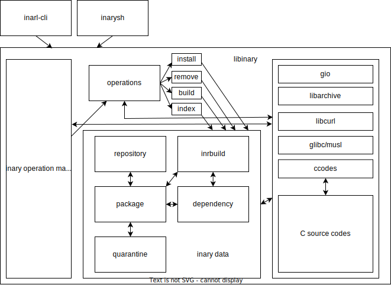

# Inary source code

## libinary documentation
look **libinary.md** file

# Writing documentation

* Document line must starts with `//DOC:`
* Document type is markdown.

# source organization

* **ccode/** has C source files.
* **data/** has package, repository and other functions.
* **operations/** has install/remove and other operation functions.
* **tools/** has command line programs.
* **util/** has utility functions for libinary.
* **color.vala** has color related functions.
* **inary.vala** is main libinary file.
* **settings.vala** has init functions and settings.
* **wslblock.vala** has wsl blocker functions.

# Exit status codes
| Number  | Meaning               |
|---------|-----------------------|
| 31      | Inary init error      |
| 3       | Archive extract error |
| 2       | File not found        |
| 1       | Operation failed      |
| 0       | Successfull           |

# How to inary works

