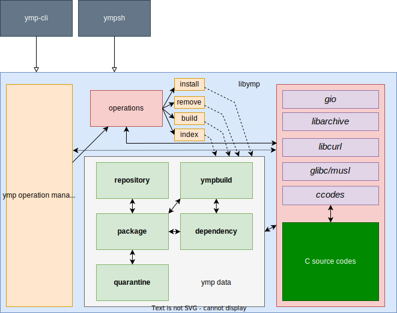

# Ymp source code

## libymp documentation
look **libymp.md** file

# Writing documentation

* Document line must starts with `//DOC:`
* Document type is markdown.

# source organization

* **ccode/** has C source files.
* **data/** has package, repository and other functions.
* **operations/** has install/remove and other operation functions.
* **tools/** has command line programs.
* **util/** has utility functions for libymp.
* **constants.h** common preprocessor definitions file
* **ymp.vala** is main libymp file.
* **settings.vala** has init functions and settings.
* **wslblock.vala** has wsl blocker functions.

# Exit status codes
| Number  | Meaning               |
|---------|-----------------------|
| 31      | Ymp   init error      |
| 3       | Archive extract error |
| 2       | File not found        |
| 1       | Operation failed      |
| 0       | Successfull           |

# How to ymp works

# How to ymp build
1. vala sources preprocess with **gcc -E -** command
1. generated vala sources converted to C sources
1. gcc compile C sources
1. link all .o files for creating libymp.so
1. main.vala converted to C source
1. gcc compile main.c file
1. gcc create ymp-cli and link with libymp.so

